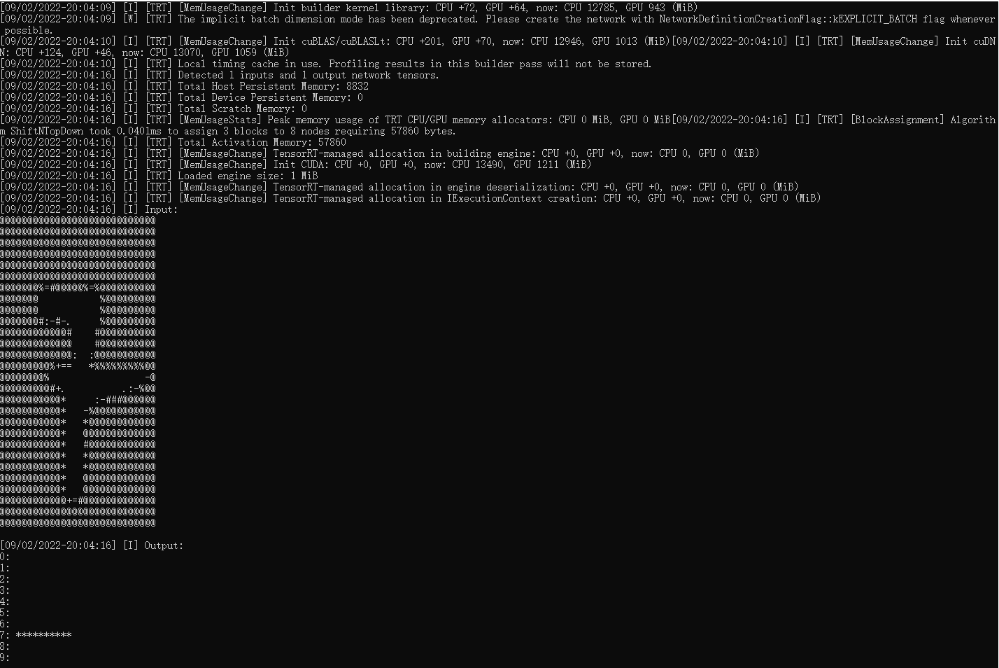
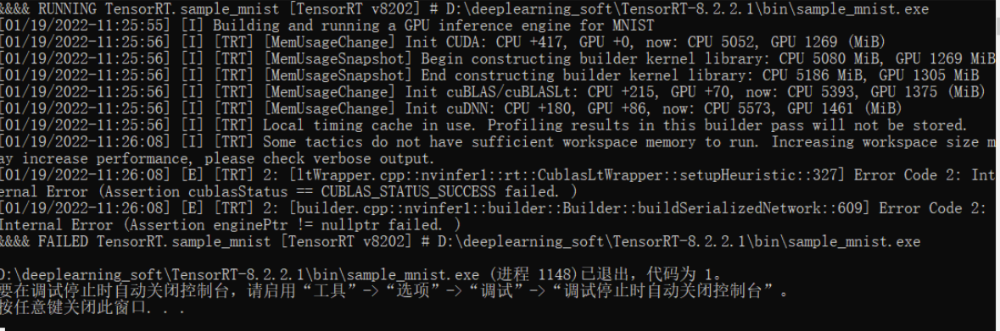
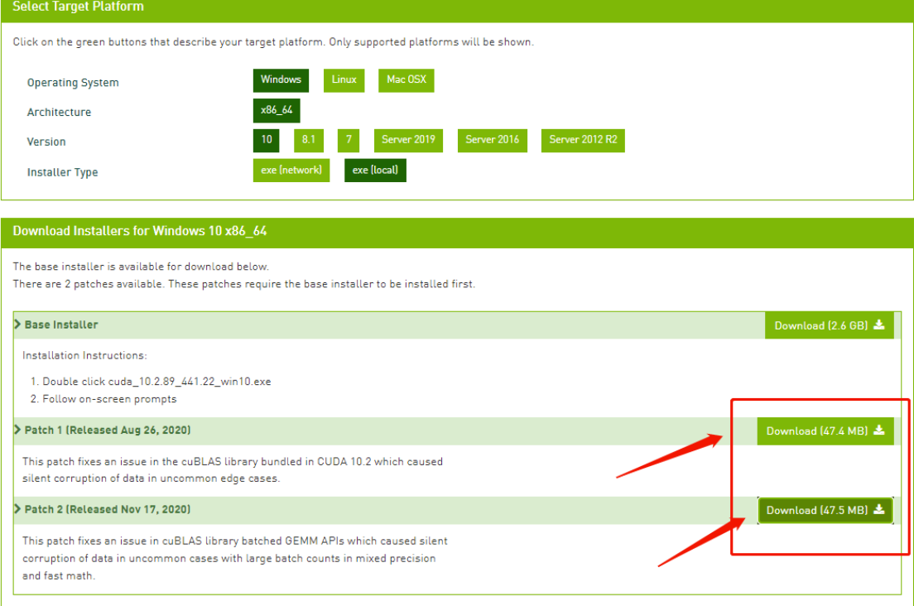

# TensorRT

## TensorRT安装
在TensorRT安装之前，首先确保你的设备安装好了 [cuda](https://developer.nvidia.com/cuda-toolkit-archive) 以及 [cudnn](https://developer.nvidia.com/cudnn) 。

我的设备cuda版本是10.2。cudnn版本是8.4.1。TensorRT版本是TensorRT-8.4.3.1.Windows10.x86_64.cuda-10.2.cudnn8.4.1

下面将以我的设备版本为例，进行安装介绍。

### windows安装

1. 首先进入 [tensorRT官网](https://developer.nvidia.com/nvidia-tensorrt-download) 下载TensorRT。TensorRT需要对应cuda以及cudnn的版本。一般来说，选择```TensorRT 8```或```TensorRT 7```,```GA```表示稳定版本，一般选择```GA```版本进行下载。```8.x/7.x```这里的```x```表示cudnn的版本。我下载的是[TensorRT-8.4.3.1](https://developer.nvidia.com/compute/machine-learning/tensorrt/secure/8.4.3/zip/tensorrt-8.4.3.1.windows10.x86_64.cuda-10.2.cudnn8.4.zip)
2. 解压下载下来的zip，进入TensorRT-8.4.3.1文件夹。 分别将

```TensorRT-8.4.3.1\include```中的头文件 复制 到```C:\Program Files\NVIDIA GPU Computing Toolkit\CUDA\v10.2\include```

```TensorRT-8.4.3.1\lib``` 中所有lib文件 复制 到```C:\Program Files\NVIDIA GPU Computing Toolkit\CUDA\v10.2\lib\x64```

```TensorRT-8.4.3.1\lib``` 中所有dll文件 复制 到```C:\Program Files\NVIDIA GPU Computing Toolkit\CUDA\v10.2\bin```

3. 验证TensorRT是否安装正确

进入TensorRT-8.4.3.1/samples/sampleMNIST中，用vs2017(或者17以上)打开sample_mini.sln，重新生成解决方案。在执行，如果一切正常。则如下所示：



4. 可能出现的错误
- 缺少zlibwapi.dll。解决方法是从 [连接](http://www.winimage.com/zLibDll/zlib123dllx64.zip) 下载，然后将```zlibwapi.lib``` 放在```C:\Program Files\NVIDIA GPU Computing Toolkit\CUDA\v10.2\lib```
将```zlibwapi.dll``` 放在 ```C:\Program Files\NVIDIA GPU Computing Toolkit\CUDA\v10.2\bin```

- cuda需要安装补丁。在sample_minis.sln下，报错内容如下：



报错内容：```[ltWrapper.cpp::nvinfer1::rt::CublasLtWrapper::setupHeuristic::327] Error Code 2: Internal Error (Assertion cublasStatus == CUBLAS_STATUS_SUCCESS failed. )'''
'''[01/19/2022-11:26:08] [E] [TRT] 2: [builder.cpp::nvinfer1::builder::Builder::buildSerializedNetwork::609] Error Code 2: Internal Error (Assertion enginePtr != nullptr failed. )```

报错原因与解决方案：CUDA10.2与TensorRT8.2的匹配有些问题，需要打CUDA补丁解决。
进入CUDA10.2的下载页面，选择CUDA补丁，下载安装即可。补丁如下图所示。
打上CUDA补丁即可解决CUDA与TensorRT匹配的问题。



5. 上述操作成功安装C++版本的tensorRT。

若想使用TensorRT python API接口。则进入```TensorRT-8.4.3.1/python```文件夹，激活虚拟环境，安装对应的xxxx.whl即可
```
# 打开cmd，进入文件夹
cd D:\develop\tensorRT\TensorRT-8.4.3.1\python
# 激活虚拟环境,trt是我的虚拟环境名字
conda activate trt
# pip 安装,因为我的python是3.7版本，所以安装的是cp37
pip install tensorrt-8.4.3.1-cp37-none-win_amd64.whl
```

6. python api验证
```
python -c "import tensorrt;print(tensorrt.__version__)" 
```

执行上述指令，正确输出版本好即可。