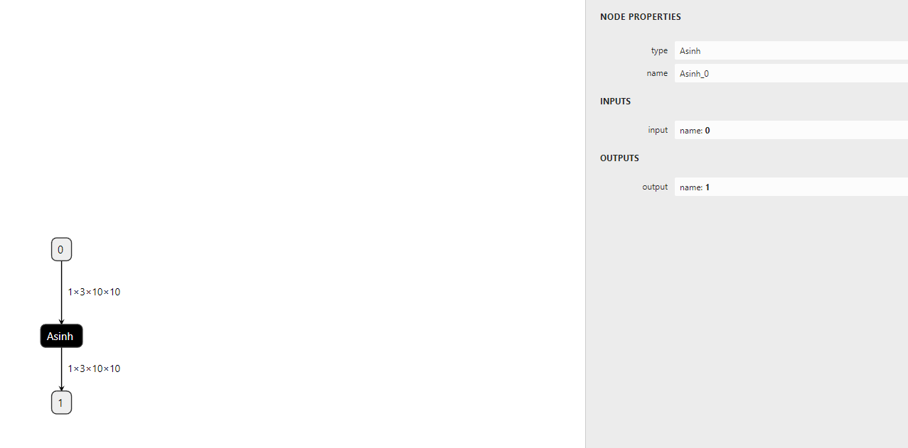
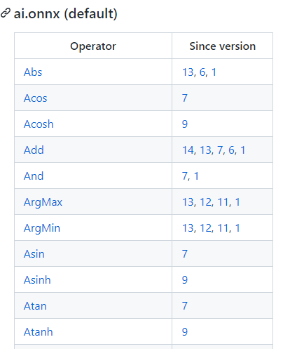
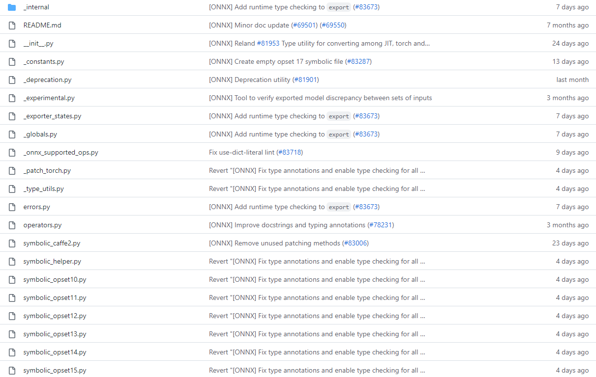
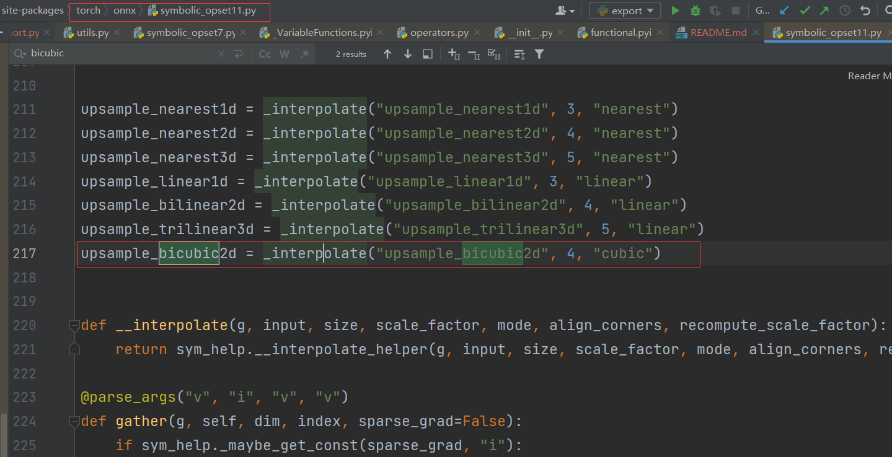
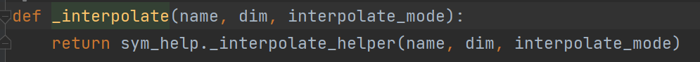
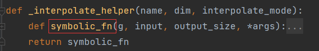
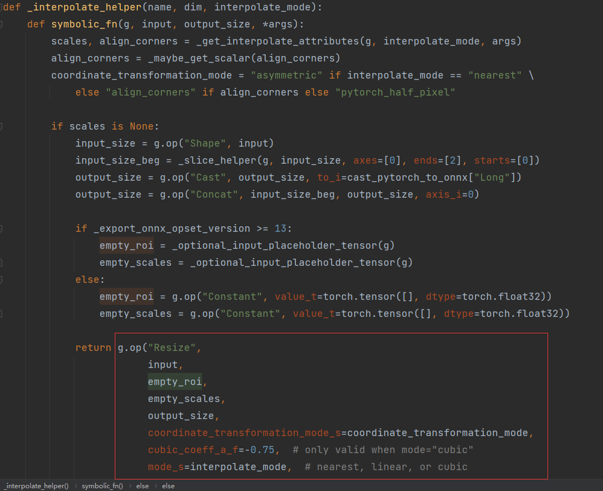
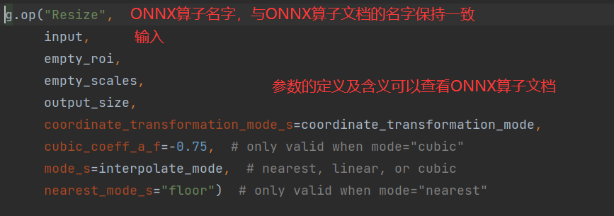

# 模型部署 之 pytorch -> onnx

要将Pytorch算子顺利转换到ONNX，需要保证以下三个环节都不出错：

- 算子在Pytorch中有实现
- 有把该算子映射成一个或多个ONNX算子的方法
- ONNX有相应的算子

而在实际项目部署中，很有可能确实其中一个或者多个环节。其中，最坏的情况就是：我们 定义了一个全新的算子，它不仅缺少Pytorch实现，还缺少Pytorch到ONNX的映射。

对于这三个环节，也分别有以下添加支持的方法：

- Pytorch算子
    - 组合现有算子
    - 添加TorchScript算子
    - 添加普通C++拓展算子
- 映射方法
    - 为ATen算子添加符号函数
    - 为TorchScript算子添加符号函数
    - 封装成 **torch.autograd.Function** 并添加符号函数
- ONNX算子
    - 使用现有ONNX算子
    - 定义新的ONNX算子

下面将围绕三种算子的映射方法，来实现三个添加算子支持的示例。

## 支持Aten算子

```Aten算子是Pytorch内置的C++张量计算库，Pytorch算子在底层绝大多数计算都是使用Aten实现。```

实际的部署过程中，可能会遇到一个最简单的算子缺失问题：算子在Aten中已经实现，ONNX中也有相关算子的定义，但是相关算子映射成ONNX的 规则没有写。在这种情况下，我们只需要为ATen算子**补充描述映射规则的符号函数**即可。

- 第一步：获取Aten中算子接口定义
- 第二步：添加符号函数

### 获取Aten中算子接口定义

为了编写符号函数，我们需要获取算子推理接口的输入参数定义。我们拿```asinh```算子举例。

我们首先去```torch/_C/_VariableFunctions.pyi```和```torch/nn/functional.pyi```这两个文件夹中搜索目标算子名字。
这两个文件是编译Pytorch时本地自动生成的文件，里面包含Aten算子的Pytorch调用接口。

通过搜索，我们可以知道 ```asinh``` 在文件 ```torch/_C/_VariableFunctions.pyi``` 中，其接口定义为:

```
def asinh(input: Tensor, *, out: Optional[Tensor]=None) -> Tensor: ...
```

经过这些步骤，我们确认了缺失的算子名为 asinh，它是一个有实现的 ATen 算子。我们还记下了 asinh 的调用接口。接下来，我们要为它补充符号函数，使它在转换成 ONNX 模型时不再报错。

### 添加符号函数

符号函数，可以看成是 PyTorch 算子类的一个静态方法。在把 PyTorch 模型转换成 ONNX 模型时，各个 PyTorch 算子的符号函数会被依次调用，以完成 PyTorch 算子到 ONNX 算子的转换。符号函数的定义一般如下：

```
def symbolic(g: torch._C.Graph, input_0: torch._C.Value, input_1: torch._C.Value, ...): 
```

其中，```torch._C.Graph``` 和 ```torch._C.Value``` 都对应 PyTorch 的 C++ 实现里的一些类。

注意：第一个参数就固定叫 ```g```，它表示和计算图相关的内容；后面的每个参数都表示算子的输入，需要和算子的前向推理接口的输入相同。对于 ```ATen``` 算子来说，它们的前向推理接口就是上述两个 ```.pyi```
文件里的函数接口。

```g``` 有一个方法 ```op```。在把 PyTorch 算子转换成 ONNX 算子时，需要在符号函数中调用此方法来为最终的计算图添加一个 ONNX 算子。其定义如下：

```
def op(name: str, input_0: torch._C.Value, input_1: torch._C.Value, ...) 
```

其中，第一个参数是算子名称。如果该算子是普通的 ONNX 算子，只需要把它在 ONNX 官方文档里的名称填进去即可

在最简单的情况下，我们只要把 PyTorch 算子的输入用```g.op()```一一对应到 ONNX 算子上即可，并把g.op()的返回值作为符号函数的返回值。在情况更复杂时，我们转换一个 PyTorch 算子可能要新建若干个 ONNX
算子。

**def symbolic(g,参数，参数 ..)里面的参数是对应pytorch算子的参数。symbolic中的op函数中的参数则是对应ONNX算子文档中的参数**

到这里，我们已经知道了pytorch中算子```asinh```的推理接口定义。也知道了在ONNX中```asinh```算子的定义。那么就可以开心的实现两者的映射关系了，如下所示：

```
from torch.onnx.symbolic_registry import register_op 
 
def asinh_symbolic(g, input, *, out=None): 
    return g.op("Asinh", input) 
 
register_op('asinh', asinh_symbolic, '', 9)  
```

这里的```asinh_symbolic```就是```asinh```的符号函数。从除```g```以外的第二个输入参数开始，其输入参数应该严格对应它在 ```ATen``` 中的定义：

```
def asinh(input: Tensor, *, out: Optional[Tensor]=None) -> Tensor: ... 
```

在符号函数的函数体中，```g.op("Asinh", input)```则完成了 ONNX 算子的定义。其中，第一个参数```"Asinh"```是算子在 ONNX 中的名称。至于第二个参数 ```input```，如我们刚刚在文档里所见，这个算子只有一个输入，因此我们只要把符号函数的输入参数 ```input``` 对应过去就行。ONNX 的 ```Asinh``` 的输出和 ```ATen``` 的 ```asinh``` 的输出是一致的，因此我们直接把 ```g.op()``` 的结果返回即可。

定义完符号函数后，我们要把这个符号函数和原来的 ATen 算子“绑定”起来。这里，我们要用到 ```register_op``` 这个 PyTorch API 来完成绑定。如示例所示，只需要一行简单的代码即可把符号函数 ```asinh_symbolic``` 绑定到算子 ```asinh``` 上：

```
register_op('asinh', asinh_symbolic, '', 9) 
```

```register_op```的第一个参数是目标 ATen 算子名，第二个是要注册的符号函数，这两个参数很好理解。第三个参数是算子的“域”，对于普通 ONNX 算子，直接填空字符串即可。第四个参数表示向哪个算子集版本注册。我们遵照 ONNX 标准，向第 9 号算子集注册。值得注意的是，这里向第 9 号算子集注册，不代表较新的算子集（第 10 号、第 11 号……）都得到了注册。在示例中，我们先只向第 ```9``` 号算子集注册。

整理一下，最终的代码如下：
```
import torch 

# 模型定义
class Model(torch.nn.Module): 
    def __init__(self): 
        super().__init__() 
 
    def forward(self, x): 
        # 调用pytorch中已有定义的算子（Aten算子）
        return torch.asinh(x) 
 
# 导入算子注册器
from torch.onnx.symbolic_registry import register_op 
 
# 符号函数，asinh_symbolic(g,参数，参数)中除了g以外的参数必须和Aten算子保持一致
def asinh_symbolic(g, input, *, out=None): 
    # 在符号函数中，调用g.op(name,参数) name则是ONNX算子文档中对应算子的名字，参数则是文档中对应的参数
    return g.op("Asinh", input) 

# 将符号函数和Aten函数绑定在一起。
register_op('asinh', asinh_symbolic, '', 9) 
 
model = Model() 
input = torch.rand(1, 3, 10, 10) 
torch.onnx.export(model, input, 'asinh.onnx') 
```

成功导出后，aisnh.onnx应该如下图所示



### 算子测试
```
import onnxruntime 
import torch 
import numpy as np 
 
class Model(torch.nn.Module): 
    def __init__(self): 
        super().__init__() 
 
    def forward(self, x): 
        return torch.asinh(x) 
 
model = Model() 
input = torch.rand(1, 3, 10, 10) 
torch_output = model(input).detach().numpy() 
 
sess = onnxruntime.InferenceSession('asinh.onnx') 
ort_output = sess.run(None, {'0': input.numpy()})[0] 

# 使用 np.allclose 来保证两个结果张量的误差在一个可以允许的范围内
assert np.allclose(torch_output, ort_output) 
```

## 支持 TorchScript 算子
对于一些比较复杂的运算，仅使用 PyTorch 原生算子是无法实现的。这个时候，就要考虑自定义一个 PyTorch 算子，再把它转换到 ONNX 中了。新增 PyTorch 算子的方法有很多，PyTorch 官方比较推荐的一种做法是添加 TorchScript 算子 。

以可变形卷积（Deformable Convolution）算子为例，介绍为现有 TorchScript 算子添加 ONNX 支持的方法。

注意：可变形卷积（Deformable Convolution）是在 Torchvision 中实现的 TorchScript 算子，虽然尚未得到广泛支持，但是出现在许多模型中。

### 使用 TorchScript 算子
和之前一样，我们首先定义一个包含了算子的模型，为之后转换 ONNX 模型做准备。

```
import torch 
import torchvision 
 
class Model(torch.nn.Module): 
    def __init__(self): 
        super().__init__() 
        self.conv1 = torch.nn.Conv2d(3, 18, 3) 
        self.conv2 = torchvision.ops.DeformConv2d(3, 3, 3) 
 
    def forward(self, x): 
        return self.conv2(x, self.conv1(x)) 
```

其中，```torchvision.ops.DeformConv2d``` 就是 ```Torchvision``` 中的可变形卷积层。相比于普通卷积，可变形卷积的其他参数都大致相同，唯一的区别就是在推理时需要多输入一个表示偏移量的张量。

然后，我们查询算子的前向推理接口。```DeformConv2d``` 层最终会调用 ```deform_conv2d``` 这个算子。我们可以在 torchvision/csrc/ops/deform_conv2d.cpp 中查到该算子的调用接口：
```
m.def(TORCH_SELECTIVE_SCHEMA( 
      "torchvision::deform_conv2d(Tensor input,  
      Tensor weight,  
      Tensor offset,  
      ...... 
      bool use_mask) -> Tensor")); 
```

那么接下来，根据之前的经验，我们就是要去 ONNX 官方文档中查找算子的定义了。

### 自定义ONNX算子
很遗憾的是，如果我们去 ONNX 的官方算子页面搜索 "deform"，将搜不出任何内容。目前，ONNX 还没有提供可变形卷积的算子，我们要自己定义一个 ONNX 算子了。

我们在前面讲过，```g.op()``` 是用来定义 ONNX 算子的函数。对于 ONNX 官方定义的算子，```g.op()``` 的第一个参数就是该算子的名称。而对于一个自定义算子，```g.op()``` 的第一个参数是一个带命名空间的算子名，比如：

```
g.op("custom::deform_conv2d, ...) 
```

其中，"::"前面的内容就是我们的命名空间。该概念和 C++ 的命名空间类似，是为了防止命名冲突而设定的。如果在 ```g.op()``` 里不加前面的命名空间，则算子会被默认成 ONNX 的官方算子。

PyTorch 在运行 ```g.op()``` 时会对官方的算子做检查，如果算子名有误，或者算子的输入类型不正确， g.op() 就会报错。为了让我们随心所欲地定义新 ONNX 算子，我们必须设定一个命名空间，给算子取个名，再定义自己的算子。

ONNX 是一套标准，本身不包括实现。在这里，我们就简略地定义一个 ONNX 可变形卷积算子，而不去写它在某个推理引擎上的实现。
此处，我们只关心如何导出一个包含新 ONNX 算子节点的 onnx 文件。因此，我们可以为新算子编写如下简单的符号函数：

```
@parse_args("v", "v", "v", "v", "v", "i", "i", "i", "i", "i", "i", "i", "i", "none") 
def symbolic(g,  
        input, 
        weight, 
        offset, 
        mask, 
        bias, 
        stride_h, stride_w, 
        pad_h, pad_w, 
        dil_h, dil_w, 
        n_weight_grps, 
        n_offset_grps, 
        use_mask): 
    return g.op("custom::deform_conv2d", input, offset) 
```

在这个符号函数中，```symbolic```函数中除了```g```之外的其他参数，和pytorch中定义的接口函数参数保持一致。

DCN在pytorch中最底层的接口函数参数如下所示：
```
deform_conv2d(
        input,
        weight,
        offset,
        mask,
        bias,
        stride_h, stride_w,
        pad_h, pad_w,
        dil_h, dil_w,
        n_weight_grps,
        n_offset_grps,
        use_mask,)
```

符号函数中```g.op```则是用来对应onnx算子，在这里，我们只用```input``` 和 ```offset``` 来构造一个简单的 ONNX 算子。

```
# 自定义的ONNX算子，必须有命名空间，防止变量名冲突，如果不带命名空间，则认为是ONNX自带算子
g.op("custom::deform_conv2d", input, offset)
```

这段代码中，最令人疑惑的就是装饰器 ```@parse_args``` 了。简单来说，TorchScript 算子的符号函数要求标注出每一个输入参数的类型。比如"v"表示 Torch 库里的 value 类型，一般用于标注张量，而"i"表示 int 类型，"f"表示 float 类型，"none"表示该参数为空。具体的类型含义可以在 [torch.onnx.symbolic_helper.py](https://github.com/pytorch/pytorch/blob/master/torch/onnx/symbolic_helper.py)
中查看。这里输入参数中的 input, weight, offset, mask, bias 都是张量，所以用"v"表示。后面的其他参数同理。我们不必纠结于 @parse_args 的原理，根据实际情况对符号函数的参数标注类型即可。

有了符号函数后，我们通过如下的方式注册符号函数：
```
register_custom_op_symbolic("torchvision::deform_conv2d", symbolic, 9) 
```

和前面的 ```register_op``` 类似，注册符号函数时，我们要输入算子名、符号函数、算子集版本。与前面不同的是，这里的算子集版本是最早生效版本，在这里设定版本 9，意味着之后的第 10 号、第 11 号……版本集都能使用这个新算子。

## 使用 torch.autograd.Function
torch.autograd.Function 能完成算子实现和算子调用的隔离。不管算子是怎么实现的，它封装后的使用体验以及 ONNX 导出方法会和原生的 PyTorch 算子一样。这是我们比较推荐的为算子添加 ONNX 支持的方法。

为了应对更复杂的情况，我们来自定义一个奇怪的 ```my_add``` 算子。这个算子的输入张量 ```a, b ```，输出 ```3a + 2b``` 的值。我们会先把它在 PyTorch 中实现，再把它导出到 ONNX 中。

### 为Pytorch添加C++拓展
为 PyTorch 添加简单的 C++ 拓展还是很方便的。对于我们定义的 ```my_add``` 算子，可以用以下的 C++ 源文件来实现。我们把该文件命名为 "my_add.cpp"：

```
// my_add.cpp 
 
#include <torch/torch.h> 

// my_add:C++函数名
torch::Tensor my_add(torch::Tensor a, torch::Tensor b) 
{ 
    return 3 * a + 2 * b; 
} 

// PYBIND11_MODULE:为C++函数提供python调用接口
// my_lib:模块名字，是未来在python里导入的模块名
// 双引号中的 my_add 是python调用的接口名字

PYBIND11_MODULE(my_lib, m) 
{ 
    m.def("my_add", my_add); 
} 
```

在这段代码中，```torch::Tensor``` 就是 C++ 中 torch 的张量类型，它的加法和乘法等运算符均已重载。因此，我们可以像对普通标量一样对张量做加法和乘法。

轻松地完成了算子的实现后，我们用 ```PYBIND11_MODULE``` 来为 C++ 函数提供 Python 调用接口。这里的 ```my_lib``` 是我们未来要在 Python 里导入的模块名。双引号中的 ```my_add``` 是 Python 调用接口的名称，这里我们对齐 C++ 函数的名称，依然用 "my_add"这个名字。

我们可以编写如下的 Python 代码并命名为 "setup.py"，来编译刚刚的 C++ 文件：
```
from setuptools import setup 
from torch.utils import cpp_extension 
 
setup(name='my_add', 
      ext_modules=[cpp_extension.CppExtension('my_lib', ['my_add.cpp'])], 
      cmdclass={'build_ext': cpp_extension.BuildExtension}) 
```

这段代码使用了 Python 的 ```setuptools``` 编译功能和 PyTorch 的 C++ 拓展工具函数，可以编译包含了 torch 库的 C++ 源文件。这里我们需要填写的只有模块名和模块中的源文件名。我们刚刚把模块命名为 ```my_lib```，而源文件只有一个 ```my_add.cpp```，因此拓展模块那一行要写成``` ext_modules=[cpp_extension.CppExtension('my_lib', ['my_add.cpp'])],```。

之后，像处理普通的 Python 包一样执行安装命令，我们的 C++ 代码就会自动编译了。

```
python setup.py develop 
```

### 用 torch.autograd.Function 封装

直接用 Python 接口调用 C++ 函数不太“美观”，一种比较优雅的做法是把这个调用接口封装起来。这里我们用 ```torch.autograd.Function``` 来封装算子的底层调用：
```
import torch 
import my_lib 
class MyAddFunction(torch.autograd.Function): 
 
    @staticmethod 
    def forward(ctx, a, b): 
        return my_lib.my_add(a, b) 
 
    @staticmethod 
    def symbolic(g, a, b): 
        three = g.op("Constant", value_t=torch.tensor([3])) 
        two = g.op("Constant", value_t=torch.tensor([2])) 
        a = g.op('Mul', a, three) 
        b = g.op('Mul', b, two) 
        return g.op('Add', a, b) 
```

```Function``` 类本身表示 PyTorch 的一个可导函数，只要为其定义了前向推理和反向传播的实现，我们就可以把它当成一个普通 PyTorch 函数来使用。

PyTorch 会自动调度该函数，合适地执行前向和反向计算。对模型部署来说，```Function``` 类有一个很好的性质：如果它定义了 ```symbolic``` 静态方法，该 ```Function``` 在执行 ```torch.onnx.export()``` 时就可以根据 ```symbolic``` 中定义的规则转换成 ONNX 算子。这个``` symbolic ```就是前面提到的符号函数，只是它的名称必须是 ```symbolic``` 而已。

在 ```forward``` 函数中，我们用 ```my_lib.my_add(a, b)``` 就可以调用之前写的C++函数了。这里 ```my_lib``` 是库名，```my_add``` 是函数名，这两个名字是在前面C++的 ```PYBIND11_MODULE``` 中定义的。

在 ```symbolic``` 函数中，我们用 ```g.op()``` 定义了三个算子：常量、乘法、加法。这里乘法和加法的用法和前面提到的 ```asinh``` 一样，只需要根据 ONNX 算子定义规则把输入参数填入即可。而在定义常量算子时，我们要把 PyTorch 张量的值传入 ```value_t``` 参数中。

在 ONNX 中，我们需要把新建常量当成一个算子来看待，尽管这个算子并不会以节点的形式出现在 ONNX 模型的可视化结果里。

把算子封装成 Function 后，我们可以把 my_add算子用起来了。
```
my_add = MyAddFunction.apply 
 
class MyAdd(torch.nn.Module): 
    def __init__(self): 
        super().__init__() 
 
    def forward(self, a, b): 
        return my_add(a, b) 
```

在这份代码里，我们先用 ```my_add = MyAddFunction.apply``` 获取了一个奇怪的变量。这个变量是用来做什么的呢？其实，```apply是torch.autograd.Function``` 的一个方法，这个方法完成了``` Function``` 在前向推理或者反向传播时的调度。我们在使用 ```Function``` 的派生类做推理时，不应该显式地调用 ```forward()```，而应该调用其 ```apply``` 方法。

这里我们使用 ```my_add = MyAddFunction.apply``` 把这个调用方法取了一个更简短的别名 ```my_add```。以后在使用 ```my_add``` 算子时，我们应该忽略 ```MyAddFunction``` 的实现细节，而只通过 ```my_add``` 这个接口来访问算子。这里 ```my_add``` 的地位，和 PyTorch 的 ```asinh, interpolate, conv2d```等原生函数是类似的。

有了访问新算子的接口后，我们可以进一步把算子封装成一个神经网络中的计算层。我们定义一个叫做的 ```MyAdd``` 的 ```torch.nn.Module```，它封装了```my_add```，就和封装了```conv2d``` 的 ```torch.nn.Conv2d``` 一样。

### 测试算子
费了好大的功夫来“包装”我们的新算子后，我们终于可以来使用它了。和之前的测试流程一样，让我们用下面的代码来导出一个包含新算子的 ONNX 模型，并验证一下它是否正确。

```
model = MyAdd() 
input = torch.rand(1, 3, 10, 10) 
torch.onnx.export(model, (input, input), 'my_add.onnx') 
torch_output = model(input, input).detach().numpy() 
 
import onnxruntime 
import numpy as np 
sess = onnxruntime.InferenceSession('my_add.onnx') 
ort_output = sess.run(None, {'a': input.numpy(), 'b': input.numpy()})[0] 
 
assert np.allclose(torch_output, ort_output) 
```

在这份代码中，我们直接把 MyAdd 作为要导出的模型。我们计算了一个 PyTorch 模型的运行结果，又导出 ONNX 模型，计算了 ONNX 模型在 ONNX Runtime 上的运算结果。如果一切正常的话，这两个结果是一样的，这份代码不会报任何错误，没有任何输出。


可视化一下 my_add.onnx，可以看出，和我们设计得一样，my_add 算子被翻译成了三个 ONNX 算子节点（其中常量算子被放入了 Mul 的参数中）。


--------------------------------------
## 总结
- ```ATen``` 是 PyTorch 的 C++ 张量运算库。通过查询 ```torch/_C/_VariableFunctions.pyi``` 和 ```torch/nn/functional.pyi```，我们可以知道 ATen 算子的 Python 接口定义。
- 用 ```register_op``` 可以为 ```ATen``` 算子补充注册符号函数
- 用 ```register_custom_op_symbolic``` 可以为 ```TorchScript``` 算子补充注册符号函数
- 如何在 PyTorch 里添加 C++ 拓展
- 如何用 ```torch.autograd.Function``` 封装一个自定义 PyTorch 算子
- 如何编写符号函数 ```symbolic(g, ...)```。
- 如何用 ```g.op()``` 把一个 PyTorch 算子映射成一个或多个 ONNX 算子，或者是自定义的 ONNX 算子。


-------------------------
# 概念知识

- Pytorch中对ONNX的算子支持
- ONNX算子文档
- Pytorch对ONNX算子的映射

## Pytorch中对ONNX的算子支持

可以在```torch/_C/_VariableFunctions.pyi```和```torch/nn/functional.pyi```这两个文件夹中搜索算子的支持。
这两个文件是编译Pytorch时本地自动生成的文件，里面包含Aten算子的Pytorch调用接口。

## ONNX算子文档

ONNX算子的定义情况：可以在 [算子文档](https://github.com/onnx/onnx/blob/main/docs/Operators.md) 中，查看算子。



这份文档中最重要的开头的这个算子变更表格。表格的第一列是算子名，第二列是该算子发生变动的算子集版本号，也就是我们之前在torch.onnx.export中提到的opset_version表示的算子集版本号。通过查看算子第一次发生变动的版本号，我们可以知道某个算子是从哪个版本开始支持的；通过查看某算子小于等于opset_version的第一个改动记录，我们可以知道当前算子集版本中该算子的定义规则。

## Pytorch对ONNX算子的映射

在Pytorch中，和ONNX有关的定义全部放在```torch.onnx```这个 [目录](https://github.com/pytorch/pytorch/tree/master/torch/onnx) 中，如下图所示：



其中，symbolic_opset{n}.py（符号表文件）即表示 PyTorch 在支持第 n 版 ONNX 算子集时新加入的内容。比如， bicubic 插值是在第 11 个版本开始支持的。我们以它为例来看看如何查找算子的映射情况。
首先，使用搜索功能，在torch/onnx文件夹搜索"bicubic"，可以发现这个这个插值在第 11 个版本的定义文件中：









我们按照代码的调用逻辑，逐步跳转到最底层的ONNX映射函数。最后，在```symbolic_fn```中，我们可以看到 插值算子是怎么样被映射成多个ONNX算子的，其中，每一个```g.op```
就是一个ONNX的定义。比如```Resize```算子就是这样定义的：




